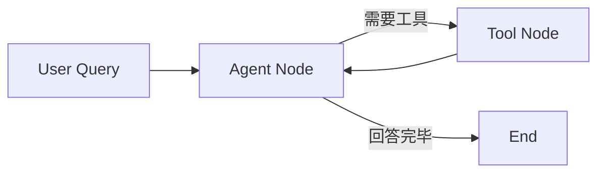

# 🧠 Dev-Agent — 从 while 循环到 LangGraph 的开发助手 Agent

[](https://dev-agent-dovd6phmnbyxrw6qzzzyzf.streamlit.app/)
[]()
[]()
[]()
[]()

基于 **LangGraph + FastAPI + Streamlit** 的完整 AI Agent + RAG 系统。支持 HTTP API 调用、Web 前端交互、Docker 一键部署，已上线可演示。

> 从 `while` 循环到 `StateGraph`，从本地玩具到线上产品——**四次架构迭代代码全部同仓保留**，可以看到一个 AI Agent 是怎么长成现在这样的。

🌐 **在线演示**：https://dev-agent-dovd6phmnbyxrw6qzzzyzf.streamlit.app/

---

## ✨ 核心亮点

- **架构演进可追溯**：v1 while ReAct → v2 logging/异常保护 → v3 流式输出 → v4 LangGraph StateGraph，四个版本代码同仓保留。
- **混合检索引擎**：自实现 BM25 + 稠密向量 + RRF 融合；BM25 接入 jieba 分词修复中文按字切分导致的召回过窄。
- **RAG 评估体系**：LLM-as-Judge 四维度（Recall / Precision / Faithfulness / Relevancy）打分并接入 RAGAS；优化后 Context Precision 从 **0.64 → 0.87（+36%）**，测试集 50 题覆盖 6 类题型。
- **MCP 工具暴露**：FastMCP 将 RAG 工具以 MCP 协议暴露，与 Claude Code 打通；文件工具带三层安全审查（黑名单 → 敏感文件检测 → 白名单）。
- **一键部署**：Dockerfile + docker-compose 本地部署，Streamlit Cloud 线上托管，面试官打开链接就能演示。

---

## 🏗️ 架构（v4 LangGraph StateGraph）



四次迭代速览：

| 版本 | 改进 | 解决的问题 |
|:---:|------|------|
| v1 | Agent 基础循环 | ReAct：思考 → 调工具 → 回答 |
| v2 | logging + 异常保护 | 工具崩溃不连累 Agent |
| v3 | 流式输出 | 打字机效果，不干等 |
| v4 | LangGraph StateGraph | 流程可视化，加功能加节点即可 |
| Web | Streamlit + SQLite + 评估面板 | 从本地 Demo 到线上产品 |

---

## 🚀 快速开始

### 方式一：Web 前端（推荐演示用）

```bash
pip install -r requirements.txt
cp .env.example .env    # 填入你的 DEEPSEEK_API_KEY
streamlit run app.py
# 浏览器打开 http://localhost:8501
```

### 方式二：HTTP API（FastAPI）

```bash
pip install -r requirements.txt
python src/api/server.py
# 浏览器打开 http://localhost:8000/docs
```

### 方式三：Docker 一键部署

```bash
docker compose up
# API: http://localhost:8000/docs
# Web: http://localhost:8501
```

---

## 🔌 API 使用

```bash
curl -X POST http://localhost:8000/chat \
  -H "Content-Type: application/json" \
  -d '{"question": "列出桌面的文件", "work_dir": "/app/host-desktop"}'
```

---

## 🧩 Agent 工具

| 工具 | 说明 |
|------|------|
| `list_files` | 列出目录内容 |
| `read_file` | 读取文件（含三层安全审查） |
| `search_in_files` | 按关键词搜索文件 |
| `search_knowledge` | 混合检索知识库（BM25 + 向量 + RRF） |
| `add_knowledge` | 添加文本到知识库 |
| `load_file_to_knowledge` | 加载文件到知识库 |

---

## 🛠️ 技术栈

| 层 | 技术 |
|---|------|
| LLM | DeepSeek API |
| Agent 框架 | LangGraph（StateGraph） |
| Web 前端 | Streamlit |
| API | FastAPI + Uvicorn |
| 数据库 | SQLite |
| 向量库 | Chroma |
| 检索 | BM25（jieba 分词）+ 向量 + RRF 融合 |
| Embedding | text2vec-base-chinese（本地，免费） |
| 安全 | 三层审查：黑名单 + 敏感文件 + 白名单 |
| 评估 | LLM Judge（4 维度 1-5 分制）+ RAGAS |
| MCP | FastMCP |
| 部署 | Docker + Streamlit Cloud |

---

## 🔍 RAG 管线

```
用户提问 → 分块 → ┬── BM25（jieba 分词）─┐
                  └── 稠密向量语义检索 ────┴─→ RRF 融合 → LLM 生成答案 + 引用来源
```

---

## 📊 评估体系

采用 LLM-as-Judge 对 RAG 质量做量化评估。将「问题 + 检索结果 + 生成答案 + 参考答案」交给 DeepSeek，逐项打分（1-5 分制）：

| 指标 | 衡量什么 |
|------|------|
| Context Recall | 检索结果是否覆盖了答案所需信息 |
| Context Precision | 相关文档是否排在检索结果前面 |
| Faithfulness | 答案是否忠实于文档（有无幻觉） |
| Answer Relevancy | 答案是否直接回应了问题 |

测试集覆盖 6 种题型（定义型、对比型、推理型、应用型、刁钻型、细节型），支持自定义测试集和 A/B 对比实验。

**优化前后（50 题测试集）**：

| 指标 | v1 基础 RAG | v2 混合检索 + 优化 |
|------|------|------|
| Context Precision | 0.64 | **0.87（+36%）** |
| Context Recall | 0.71 | **0.85** |
| Faithfulness | 0.82 | **0.91** |
| Answer Relevancy | 0.78 | **0.89** |

---

## 📂 项目结构

```
dev-agent/
├── app.py                        # Streamlit Web 入口
├── pages/                        # 知识库管理 / 文档上传 / 智能问答 / 评估面板
├── src/
│   ├── agent/                    # v1-v4 四个版本的 Agent 实现
│   ├── tools/                    # 文件工具 / 安全审查 / 混合检索
│   ├── api/server.py             # FastAPI 服务
│   ├── mcp_server.py             # MCP 协议工具服务器
│   ├── database.py               # SQLite 数据库
│   ├── parser.py / chunker.py    # 文档解析与分块
│   ├── vector_store.py           # Chroma 向量存储
│   ├── rag_agent.py              # RAG 问答 Agent
│   └── evaluate_rag.py           # RAGAS 评估脚本
├── knowledge/                    # 知识库文档
├── Dockerfile + docker-compose.yml
└── requirements.txt
```

---

## ⚠️ 已知问题

- Python 3.13 与 sentence-transformers 存在兼容问题，本地需 Python 3.11
- Docker 环境统一用 Python 3.11

---

## 👤 作者

**吴永健** · AI Agent / LLM 应用开发方向找实习 · 湖南工商大学 2027 届

📧 2416234104@qq.com · 📱 17384900236 · 🐙 [github.com/wuuu0236](https://github.com/wuuu0236)

## 📄 许可证

MIT
