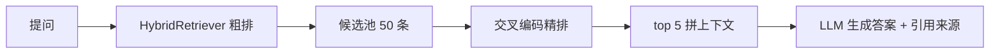
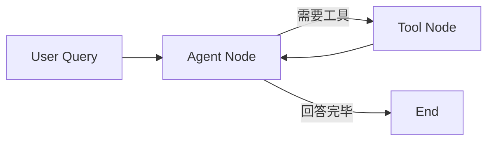

# 🧠 DataLens — 个人知识库 RAG 问答系统

[](https://dev-agent-dovd6phmnbyxrw6qzzzyzf.streamlit.app/)
[]()
[]()
[]()
[]()

基于 **FastAPI + Streamlit + LangGraph** 的个人知识库问答系统：本地文档解析与索引（向量 + BM25 + RRF 融合）、多轮追问消解、交叉编码精排、RAGAS 量化评估，另带文件操作 Agent 与 MCP 工具接口。已上线可演示。

🌐 **在线演示**：https://dev-agent-dovd6phmnbyxrw6qzzzyzf.streamlit.app/

---

## ✨ 核心亮点

- **多轮追问消解（查询改写）**：检索前先做一层查询改写，把「历史对话 + 当前问题」压成一句自包含查询再检索，支持连续追问（`src/query_rewrite.py`）。单轮提问零成本跳过；改写失败或结果异常自动退回原 query，与精排同一套降级策略。
- **检索质量门控（阈值拒答）**：生成前设一道门槛——最高精排分低于阈值（默认 0.3）时，不把上下文交给模型，改用无依据提示词如实回答「知识库中没有找到」（`src/answer_gate.py`），降低幻觉与越界回答。
- **混合检索引擎**：稠密向量 + 自实现 BM25（jieba 分词 + 停用词过滤）双路召回，RRF 融合后截断回候选池大小（50 条）。向量擅长语义匹配，BM25 擅长专有名词的词面精确匹配，两路互补；融合后截断，多开一路召回不增加精排成本（`src/hybrid_retriever.py`）。
- **交叉编码精排（Rerank）**：候选池 50 条由 `bge-reranker-v2-m3` 逐条精排取 top 5 进上下文。A/B 实测（同库同测试集，只切这一个开关）：Recall@5 0.960→1.000、Hit@1 0.840→0.920、MRR 0.887→0.960；任一批次失败自动降级为粗排顺序，不影响问答可用性。
- **数据清洗管线**：归一化 → 跨页页眉页脚去除（按页首尾行跨页统计）→ PDF 硬换行断句合并 → 垃圾块过滤，收口在 `parser.parse_file()`，Web 上传 / Agent 工具 / 脚本灌库三条入库路径全覆盖，可一键开关做 A/B。
- **Word 表格解析**：按文档真实阅读顺序提取段落与表格，表格序列化为行式自包含文本（`- 列名：值；列名：值`），任意一行单独拿出来语义都是完整的，表格内容不丢失。
- **RAG 评估体系**：基于业界标准 **ragas** 的四维量化评估（Context Precision / Context Recall / Faithfulness / Answer Relevancy，0-100 百分制），支持「同一测试集多配置对比」+ 历史存档；另保留手写 LLM Judge 作对照。检索层另有独立评测脚本（Recall@K / Hit@K / Hit@1 / MRR）。
- **问答日志 / 缺口清单**：每次问答自动落一条现场快照（实际检索 query、命中片段、最高精排分、是否被门控拦截），在评估面板汇总成不依赖人工操作的信号源；未命中的问题按最高分自动分成两类待办：**差点过阈 → 该调检索**（纯计算、可反复试）／**无语义邻居 → 该补文档**（要人找资料）（`src/answer_log.py`）。
- **多模态文档解析**：基于 RapidOCR 的本地 OCR，支持图片直读 + 扫描版 PDF 识别，数据不出域；命中图片块时可接本地视觉模型（Ollama minicpm-v 等）看图回答。
- **私有化 / 离线部署**：推理后端一键切换为本地 **Ollama**（qwen2.5:7b 等），Embedding 亦可走本地模型，实现完全离线、数据不出本机的本地个人使用。
- **多知识库隔离**：SQLite 管理元数据、Chroma 管理向量，多知识库并行管理、互不干扰，配评估面板可直接对上传文档跑评估。
- **语义缓存**：以问题向量为键、按余弦相似度模糊匹配，重复 / 换个说法的提问直接命中秒回（实测约 0.2s，首次生成约 6s）；知识库文档增删时缓存自动作废（`src/query_cache.py`）。
- **引用可核实**：回答中的 `[n]` 序号由代码映射回真实检索块，文件名与页码不由模型生成；展开引用可查看该文档被命中的原文片段，可追溯、可核实（`src/citations.py`）。
- **索引可重建**：上传时按知识库保留原始文件，分块 / 嵌入参数调整后可在管理页一键重建索引，让老文档应用新规则；重建逐文档替换，单个文件失败不连累其他，缺原文的如实报告（`src/reindex.py`）。
- **MCP 工具暴露**：FastMCP 将 RAG 工具以 MCP 协议暴露（`search_user_knowledge` 等 4 个工具），与 Claude Code / Codex 打通；文件工具带三层安全审查（黑名单 → 敏感文件检测 → 白名单）。
- **容器化部署**：Dockerfile + docker-compose（当前 compose 只含 API 服务，详见文末「已知问题」）；Streamlit Cloud 线上托管，冷启动自动预置演示知识库，开箱即用。
- **CI 质量保障**：GitHub Actions 三道关——①静态检查（pyflakes 零告警）②依赖自检（逐个 import 核心依赖并打印版本，缺包发 GitHub annotation）③冒烟测试（22 个测试文件，只跑确定性逻辑）。另有常驻守卫测试：首页每个能力断言与代码真实值比对、`.env.example` 覆盖 config 全部键、任何模块在无 API key 环境下可 import。
- **React 新版前端**：`frontend/` 提供 React 18 新界面，五页对照 Streamlit（智能问答 / 知识库管理 / 文档上传 / 评估面板 / 问答日志），esbuild 打包为单个自包含 HTML，由 FastAPI 同源托管在 `/app`；问答走同一套 `rag_query` 链路，另含知识库管理、上传入库、重建索引、问答日志、评估存档等 REST 端点（`src/api/web_api.py`，见 `docs/react-frontend.md`）。

---

## 🏗️ 架构

**三种入口共用一套检索内核（`HybridRetriever`），其中有两条不同的实现路径**，分工见下一节。上面是线上演示实际跑的路径（确定性 RAG 管道，无 LangGraph）；下面是 HTTP API 路径（LangGraph 工具循环）。

> ⚠️ **只有 Streamlit Web 部署在线上**（[Demo](https://dev-agent-dovd6phmnbyxrw6qzzzyzf.streamlit.app/)）。HTTP API、MCP 工具服务、文件操作 Agent 均**仅在本机运行**——这是设计边界，不是未完成项：Streamlit Cloud 只运行一个 Streamlit 应用（单端口、无常驻进程），放不下需要独立端口的 API 与 stdio 常驻的 MCP；文件 Agent 的工作目录与安全白名单都指向本机（`ALLOWED_DIRS = ["C:\\Users", ...]`），暴露到公网等于开放服务器文件系统。同一份说明见线上首页「运行方式与能力边界」。

**Web 智能问答 — 快路径（确定性 RAG，无 LangGraph）**


```mermaid
flowchart LR
    A[提问] --> B[HybridRetriever 粗排]
    B --> C[候选池 50 条]
    C --> D[交叉编码精排]
    D --> E[top 5 拼上下文]
    E --> F[LLM 生成答案 + 引用来源]
```

**HTTP API — 慢路径（LangGraph StateGraph）**


```mermaid
flowchart LR
    A[User Query] --> B[Agent Node]
    B -->|需要工具| C[Tool Node]
    C --> B
    B -->|回答完毕| D[End]
```

---

## 🧭 入口分工，一个大脑

| 入口 | 定位 | 能力 | 线上 |
|------|------|------|:----:|
| **Web 智能问答**（`pages/3_💬_智能问答.py`） | 知识库问答（纯 RAG，快路径） | 快、带引用来源、6 轮追问上下文 | ✅ |
| **React 前端**（`frontend/` + `/api/*`） | 新版界面（已接后端） | 五页对照 Streamlit：问答 / 管理 / 上传 / 评估 / 日志；由 FastAPI 同源托管在 `/app` | ❌ 本机 |
| **HTTP API**（`/chat`、`/chat/stream`） | 文件操作 Agent（LangGraph 工具循环，慢路径） | 文件工具 + 顺手查知识库；历史 / 流式与 RAG 对齐 | ❌ 本机 |
| **MCP 工具服务**（`src/mcp_server.py`） | 供 Claude Code / Codex 调用 | `search_user_knowledge` 等 4 个工具 | ❌ 本机 |

关键原则：**知识库问答走 RAG，文件/工具操作走 Agent**，各司其职——而不是把 RAG 也塞进 ReAct 循环，那只会让问答变慢、引用变难。两条路径共用 `HybridRetriever`（检索结果一致），都支持最近 6 轮对话注入（多轮追问不丢上下文）。`/chat/stream` 是**真流式**（按 token 吐），不是跑完再切块的假流式。

Web 问答路径还带**语义缓存**（`src/query_cache.py`）：无历史的独立提问先查缓存，命中直接秒回——本质是「数据库查询缓存的知识库版」，键换成问题向量、按余弦相似度模糊匹配（换说法也能命中）；知识库文档变化（上传/删除）时缓存自动作废。实测同问命中约 **0.2s**（首次生成约 6s）。

---

## 🚀 快速开始

### 方式一：Web 前端（推荐演示用）

```bash
conda activate dev-agent   # 推荐用项目独立环境（Python 3.11，与 Dockerfile 一致）
pip install -r requirements.txt
cp .env.example .env    # ⚠️ 要填两个 key：DEEPSEEK_API_KEY + EMBEDDING_API_KEY（硅基流动）
streamlit run app.py
# 浏览器打开 http://localhost:8501
# 首次启动自动预置「DataLens 演示」知识库（scripts/seed.py），打开即可直接问答
```

> ⚠️ **两个 key 都要填，不能只填一个。** LLM 走 DeepSeek、Embedding 与精排走硅基流动，
> **两家 key 不通用**。只填 `DEEPSEEK_API_KEY` 时，`EMBEDDING_API_KEY` 会回退成它去请求
> 硅基流动，**必然 401**，且报错信息不会指向这个原因（守卫测试：`tests/test_env_example.py`）。

### 方式二：HTTP API（FastAPI）

```bash
pip install -r requirements.txt
python src/api/server.py
# 浏览器打开 http://localhost:8000/docs
```

### 方式三：React 前端（新版界面）

```bash
python src/api/server.py
# 浏览器打开 http://localhost:8000/app   → React 前端（接真实后端）
#            http://localhost:8000/docs  → API 文档（含 /api/* 全部端点）
```

> React 18 实现，打包成单个自包含 HTML（约 187 KB，零外部依赖），由 FastAPI 同源托管在 `/app`。
> 五页（智能问答 / 知识库管理 / 文档上传 / 评估面板 / 问答日志）全部接**真实后端**：走同一套
> `rag_query` 链路（检索、门控、引用与 Streamlit 完全一致），上传、重建索引、问答日志、评估存档都是真数据。
> 后端未启动时前端自动回退演示数据（侧边栏标注「演示数据」），单独双击 `frontend/index.html` 也能演示。
> 接口清单与技术细节见 [`docs/react-frontend.md`](docs/react-frontend.md)。

### 方式四：Docker 部署（当前仅含 API 服务）

```bash
docker compose up
# API: http://localhost:8000/docs
```

> 该 compose 只映射并启动 FastAPI（8000）；Web 界面请按「方式一」在宿主机启动，细节见文末「已知问题」。

---

## 🔌 API 使用

```bash
# 单轮提问
curl -X POST http://localhost:8000/chat \
  -H "Content-Type: application/json" \
  -d '{"question": "列出桌面的文件", "work_dir": "/app/host-desktop"}'

# 多轮追问：把之前的对话放进 history（不含当前问题，最近的在末尾）
curl -X POST http://localhost:8000/chat \
  -H "Content-Type: application/json" \
  -d '{"question": "那第二点呢", "work_dir": "/app/host-desktop",
       "history": [{"role": "user", "content": "混合检索有什么好处"},
                   {"role": "assistant", "content": "混合检索结合了关键词与语义..."}]}'

# 流式：答案按 token 边生成边返回（打字机效果）
curl -N -X POST http://localhost:8000/chat/stream \
  -H "Content-Type: application/json" \
  -d '{"question": "读取 111.txt 的内容"}'
```

---

## 🧩 Agent 工具

| 工具 | 说明 |
|------|------|
| `list_files` | 列出目录内容 |
| `read_file` | 读取文件（含三层安全审查） |
| `search_in_files` | 按关键词搜索文件 |
| `search_knowledge` | 检索知识库（BM25 + 向量 → RRF 融合 → 候选池截断 → 精排） |
| `add_knowledge` | 添加文本到知识库 |
| `load_file_to_knowledge` | 加载文件到知识库 |

---

## 🛠️ 技术栈

| 层 | 技术 |
|---|------|
| LLM | DeepSeek API（云端） / Ollama 本地模型（私有化可选） |
| Agent 框架 | LangGraph（StateGraph） |
| Web 前端 | Streamlit（线上）+ React 18（新版界面 `frontend/`，esbuild 单文件打包，FastAPI 同源托管 `/app`，接真实后端） |
| API | FastAPI + Uvicorn |
| 数据库 | SQLite |
| 向量库 | Chroma |
| 查询改写 | 多轮追问消解：历史 + 当前问题 → 自包含检索 query（仅追问触发，失败退回原 query） |
| 质量门控 | 精排分数阈值拒答：未达阈值不注入上下文，改由无依据提示词如实说「知识库中没有找到」（可配可关） |
| 引用 | 序号 → 真实来源映射 + 命中原文片段（防编造 / 可追溯 / 可核实） |
| 索引运维 | 原文留存 + 一键重建索引（`reindex.rebuild_kb`，改参数后老文档可重跑） |
| 检索 | 稠密向量（Chroma · cosine）+ BM25（jieba 分词）+ RRF 融合 |
| 精排 | bge-reranker-v2-m3 交叉编码（硅基流动 API；失败自动降级为粗排顺序） |
| 数据清洗 | 自实现四步清洗（归一化 / 页眉页脚 / 硬换行合并 / 垃圾块过滤） |
| Embedding | 硅基流动 API（默认） / Ollama 本地模型（离线可选） |
| 多模态解析 | RapidOCR 本地 OCR（图片直读 + 扫描版 PDF 识别） |
| 视觉模型 | Ollama minicpm-v 等（命中图片块时真·看图，可选） |
| 安全 | 三层审查：黑名单 + 敏感文件 + 白名单 |
| 评估 | RAGAS（0-100 百分制）+ 手写 LLM Judge 对照 |
| MCP | FastMCP |
| 部署 | Docker + Streamlit Cloud |

---

## 🔍 RAG 管线

**索引侧（离线，文档入库时跑一次）**

```
文档 → 解析（PyMuPDF / python-docx / RapidOCR）
     → 清洗（归一化 · 跨页页眉页脚去除 · 硬换行合并 · 垃圾块过滤）
     → 分块（滑窗 500 字 / 重叠 50 字，过短碎块并入相邻块）
     → 嵌入（bge-large-zh-v1.5，1024 维；分批 64 条 + 指数退避重试）
     → 入库（Chroma，cosine 空间；同来源文件重传自动替换旧块）
     → 原文留存（data/uploads/{kb_id}/，供日后「重建索引」按新参数重跑）
```

**检索侧（在线，每次提问跑一次）**

```
提问 → 追问消解（仅多轮：历史 + 当前问题 → 一句自包含查询；单轮跳过）
     → ┬── BM25（jieba 分词 + 停用词过滤；零分词块不入池）─┐
       └── 稠密向量语义检索 ────────────────────────────┴─→ RRF 融合
                                              → 截断到候选池 50 条
                                              → bge-reranker-v2-m3 精排
                                              → 质量门控（最高分 < 阈值 → 不注入上下文，如实说不知道）
                                              → top 5 拼上下文
                                              → LLM 生成答案 + 引用来源
```

> 两个容易被忽略的设计点：
> 1. **截断发生在融合之后**，所以候选池大小是固定的 50 条，与开了几路召回无关。不截断的话，每加一路召回都会把精排的账单顺手抬高一截（精排按文档条数计费）。截断后多路共识的候选会顶掉只有单路支持的低分候选——这正是 RRF 想要的效果。
> 2. **精排分数有小幅抖动**：实测同一批输入连调三次，分数最大差 ±0.01（50 条里 30 条差异 >1e-4），但**前 5 名排序完全一致**。所以做 A/B 只看排名类指标（Recall / Hit@K / MRR），分数的绝对值变化小于 0.01 时不要当结论。

---

## 🖼️ 多模态文档解析 & 私有化部署

个人知识库里大量是**截图、带图笔记、扫描资料**——纯文本解析会整页丢失。本项目在解析层无缝接入本地 OCR，并支持切换到本地推理后端，直接补齐这两块能力。

### 1. 多模态解析（RapidOCR，本地、数据不出域）

- **图片直读**：上传 PNG/JPG 等，经 RapidOCR 提取文字后切块入库，可被正常检索问答。
- **扫描版 PDF**：文字层为空的页自动渲染成图并 OCR，避免扫描合同"有页无字"。
- **视觉模型接地**（可选）：若配置了本地视觉模型（如 `minicpm-v:8b`），命中图片块时先由视觉模型"真看图"生成识别结果，再交主 LLM 综合回答并标注引用；云端文本模型模式则自动仅用 OCR 文字，**绝不向云端模型发送图片**。

### 2. 私有化 / 离线部署（Ollama）

通过设置环境变量切换推理后端，适配本地私有化 / 隐私保护场景：

```bash
# .env
LLM_BACKEND=ollama
OLLAMA_BASE_URL=http://localhost:11434/v1
OLLAMA_LLM_MODEL=qwen2.5:7b
OLLAMA_VISION_MODEL=minicpm-v:8b      # 可选：启用真·看图

EMBEDDING_BACKEND=ollama             # 可选：索引也走本地，完全离线
OLLAMA_EMBED_MODEL=nomic-embed-text
```

- **推理阶段零云端依赖、断网可用**，文档与个人数据不出本机。
- 前端「智能问答」页提供「⚙️ 模型设置」面板，可临时切换后端与视觉模型，无需改配置。
- 默认仍为 `cloud`（DeepSeek）模式，已部署的线上 Demo 行为不变。

---

## 📊 评估体系（RAGAS · 百分制）

用业界标准框架 **ragas** 对 RAG 质量做量化评估（0-100 百分制）。将「问题 + 检索结果 + 生成答案 + 参考答案」喂给 ragas 四指标：

| 指标 | 衡量什么 | 计算机制 |
|------|------|------|
| Context Recall | 检索结果是否覆盖答案所需信息 | LLM 判相关 |
| Context Precision | 相关文档是否排在检索结果前面 | LLM 判相关 + 排名 |
| Faithfulness | 答案是否忠实于文档（有无幻觉） | 把答案拆成原子命题逐条核对 |
| Answer Relevancy | 答案是否直接回应问题 | 语义相似度（embedding） |

关键能力：

- **问答日志（线上真实提问）**：不需要任何人操作、线上自然积累。面板把未命中的问题分档成「该调检索」和「该补文档」两张待办清单，并露出每次的最高精排分（`0.28` 和 `0.02` 含义相反，但在系统里长得一模一样）。
- **配置对比（对比评分）**：同一测试集、多组检索配置（如 top_k=3/5）各跑一遍，量化「调参到底有没有用」。
- **历史存档**：每次对比自动存 JSON，面板可回看「上次 vs 这次」。
- **可复现**：面板选知识库 → 跑 RAGAS / 配置对比，数字能重新得到。
- **手写 Judge 对照**：另保留自实现四维 LLM Judge（与 RAGAS 同方法论），可交叉验证。

> 面板顺序是刻意的：**先线上日志、后测试集**。测试集是自己出的题，只能验证「改完有没有变好」，证明不了「该改哪里」——线上日志才知道用户真正被什么卡住了。反过来先跑测试集，就只是在自己出的题上自证。

示例结果（公开文档库 `f99c2c78` · 10 题测试集 · 2026-08-02 测得，存档见 `data/eval_history/eval_20260802_191741.json`）：

| 配置 | Context Precision | Context Recall | Faithfulness | Answer Relevancy |
|------|:---:|:---:|:---:|:---:|
| top_k=3 | 47.5% | 25.0% | 55.6% | 39.5% |
| top_k=5 | 47.0% | 25.0% | 59.3% | 37.9% |

> 该批次早于数据清洗与交叉编码精排上线，此处仅用于展示指标口径与「配置对比」的形式；**当前配置的指标请在 Demo 的「评估面板」实时测得**。
>
> ⚠️ 数字取决于「测试集 ↔ 知识库内容」的匹配度：库里没有的题，Context Recall 会诚实地归零（如 RRF 相关题在示例里是 0）。评估衡量的是「给定这个库，检索 + 回答好不好」，而非固定分数——换个匹配的知识库/测试集即可重新测得。同理，测试集越小数字越容易失真（同一批问题在 5 题测试集上曾测出 100% 的 Context Recall），这也是本项目坚持留存全部历史存档的原因。

---

## 🔭 Agent 可观测性（Langfuse）

Agent 每次调用的完整链路自动上报到 Langfuse Cloud，
按 session_id / prompt 版本聚合，量化定位是 LLM 慢还是检索慢。


核心埋点：

- LangGraph `graph.stream()` 挂 `CallbackHandler`，一次调用自动产生 `call_model / call_tools` 两类 span。
- RAG 主流程用 `@observe` 装饰 `rag_query / generate_answer`，自动捕获函数输入输出和延迟。
- **不使用 `langfuse.openai` 客户端**：它会全局 patch openai 客户端、干扰 RAGAS 评测（部分环境还会导入即崩）。Token 与延迟统一由 `@observe` 捕获。

---

## 📂 项目结构

```
dev-agent/
├── app.py                        # Streamlit Web 入口（冷启动自动补演示知识库）
├── pages/                        # 4 个页面：知识库管理 / 文档上传 / 智能问答 / 评估面板
├── frontend/                     # React 18 新版界面：app.jsx 源码 + esbuild 单文件打包 → index.html（由 FastAPI 托管在 /app）
├── src/
│   ├── config.py                 # 配置中枢（所有开关集中在此，环境变量可覆盖）
│   ├── parser.py                 # 文档解析（PDF / docx / txt / md / 图片 OCR）
│   ├── cleaner.py                # 数据清洗四步流水线
│   ├── chunker.py                # 分块（滑窗 + 标题树两种策略 + 碎块合并）
│   ├── embeddings.py             # 嵌入层（分批 / 重试 / 查询侧编码；云端与本地双后端）
│   ├── vector_store.py           # Chroma 向量存储（增删改查、按来源删除）
│   ├── reranker.py               # 交叉编码精排（bge-reranker-v2-m3）
│   ├── query_rewrite.py          # 多轮追问消解（历史 + 当前问题 → 自包含检索 query）
│   ├── answer_gate.py            # 检索质量门控（精排分数低于阈值 → 不注入上下文，如实说不知道）
│   ├── citations.py              # 引用来源整理（序号 → 真实来源映射 + 命中原文，防编造、可核实）
│   ├── reindex.py                # 重建索引（用保留的原文，按当前配置重跑全库）
│   ├── hybrid_retriever.py       # 混合检索（向量 + BM25 + RRF 融合）
│   ├── rag_qa.py                 # 线上 Web 问答主链路（改写 → 检索 → 门控 → 拼上下文 → 生成 → 引用）
│   ├── query_cache.py            # 语义缓存（重复/相似问题秒回，向量方案变更自动失效）
│   ├── answer_log.py             # 问答现场快照（反馈环 P0：缺口清单 / 快照在门控前抓）
│   ├── database.py               # SQLite 元数据（知识库 / 文档）
│   ├── evaluation_ragas.py       # RAGAS 四维评估（0-100 百分制）
│   ├── evaluation.py             # 手写 LLM Judge 对照实现（与 RAGAS 同方法论）
│   ├── mcp_server.py             # MCP 协议工具服务器（FastMCP）
│   ├── agent/
│   │   └── dev_agent_langgraph.py  # LangGraph 工具循环 Agent（HTTP API 路径）
│   ├── api/server.py             # FastAPI 服务（/chat、/chat/stream；挂载 /api/* 与 React 前端 /app）
│   └── api/web_api.py            # 给 React 前端的 REST 层（协议转换，复用 Streamlit 同一套模块）
│   └── tools/
│       ├── file_tools.py         # list_files / read_file / search_in_files
│       └── safety.py             # 三层安全审查（黑名单 → 敏感文件 → 白名单）
├── scripts/                      # 运维脚本
│   ├── seed.py                   # 预置演示知识库（幂等，冷启动自动调用）
│   ├── build_eval_kb.py          # 构建检索评测语料库
│   └── eval_retrieval.py         # 检索评测（Recall@K / Hit@K / Hit@1 / MRR）
├── tests/                        # 22 个测试文件（首页文案一致性 / 环境变量模板一致性 / 无凭据可导入 / 问答日志与抓取点 / 推理后端分派 / 表格解析 / 清洗 / 分块 / 混合检索融合 / 精排 / 追问改写 / 质量门控 / 引用 / 重建索引 / 嵌入 / 删除一致性 / 安全 …）
├── knowledge/                    # 知识库样例文档
├── docs/                         # 正式文档（产品设计方案、React 前端技术文档、面试速记）
├── notes/                        # 设计与审查笔记（RAG 六环节、MaxKB 对标、工程审查、反馈环方案）
├── ingest_missing.py             # 一次性补数据脚本
├── run_eval_experiment.py        # 评估实验脚本
├── .github/workflows/ci.yml      # CI：静态检查 → 依赖自检 → 冒烟测试（失败摘要转成匿名可读的 annotation）
├── Dockerfile + docker-compose.yml
└── requirements.txt / requirements-dev.txt
```

---

## ⚠️ 已知问题

- **Docker 只起 API**：`docker-compose.yml` 目前只映射并启动 FastAPI（8000），未包含 Web 服务；且其中挂载了开发者本机的桌面路径（`C:/Users/24162/Desktop:/app/host-desktop`），在别的机器上需自行调整。
- **Python 版本标注不一致**：`Dockerfile` 用 `python:3.11-slim`，`runtime.txt` 声明 `3.13.0`（供 Streamlit Cloud 使用）。两者用途不同，但本地开发建议与 Dockerfile 对齐用 3.11。
- **PDF 表格的行列关系会错乱**：PDF 文本层里**没有表格结构，只有坐标**。实测一张 3×3 表格解析出来是这样（内容一个不少，但行列全乱）：
  ```
  基金代码年化收益风险等级025490
  12.5%中高270042
  8.3%中
  ```
  表头三个字段被压成一行连在一起，并把 `025490` 吸到了第一行末尾；第二行又混进了上一行的 `12.5%中高`。它与 `.docx` 是**两种性质不同的问题**：docx 是"内容丢失"（有现成结构可读，已修复）；PDF 是"内容都在、结构丢失"，要修得基于坐标做版面分析（行/列聚类）。OCR 路径同理。

---

## 👤 作者

**吴永健** · AI Agent / LLM 应用开发方向找实习 · 湖南工商大学 2027 届

📧 2416234104@qq.com · 📱 17384900236 · 🐙 [github.com/wuuu0236](https://github.com/wuuu0236)

## 📄 许可证

MIT
