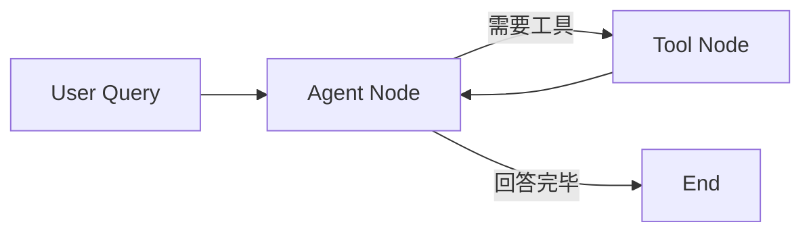

# 🧠 Dev-Agent — 从 while 循环到 LangGraph 的开发助手 Agent

[](https://dev-agent-dovd6phmnbyxrw6qzzzyzf.streamlit.app/)
[]()
[]()
[]()
[]()

基于 **LangGraph + FastAPI + Streamlit** 的完整 AI Agent + RAG 系统。支持 HTTP API 调用、Web 前端交互、Docker 一键部署，已上线可演示。

> 从 `while` 循环到 `StateGraph`，从本地玩具到线上产品——**四次架构迭代代码全部同仓保留**，可以看到一个 AI Agent 是怎么长成现在这样的。

🌐 **在线演示**：https://dev-agent-dovd6phmnbyxrw6qzzzyzf.streamlit.app/

---

## ✨ 核心亮点

- **架构演进可追溯**：v1 while ReAct → v2 logging/异常保护 → v3 流式输出 → v4 LangGraph StateGraph，四个版本代码全部保留（v4 为主，v1-v3 见 src/agent/legacy/）。
- **混合检索引擎**：自实现 BM25 + 稠密向量 + RRF 融合；BM25 接入 jieba 分词修复中文按字切分召回过窄。当前线上配置为纯向量检索（经 A/B 测试，当前文档场景下纯向量优于混合），保留 BM25 代码可一键切换。
- **RAG 评估体系**：基于业界标准 **ragas** 的四维量化评估（0-100 百分制），支持「同一测试集多配置对比」+ 历史存档；另保留手写 LLM Judge 作对照。
- **多模态文档解析**：基于 RapidOCR 的本地 OCR，支持**图片直读 + 扫描版 PDF 识别**，数据不出域；命中图片块时可接本地视觉模型（Ollama minicpm-v 等）真·看图。
- **私有化 / 离线部署**：推理后端可一键切换为本地 **Ollama**（qwen2.5:7b 等），Embedding 亦可走本地模型，实现**完全离线、数据不出本机**的本地个人使用。
- **多知识库隔离 + 评估面板**：SQLite 管理元数据、Chroma 管理向量，支持多知识库并行管理；Streamlit 评估面板对上传的真实文档直接跑 LLM 评估指标。
- **MCP 工具暴露**：FastMCP 将 RAG 工具以 MCP 协议暴露，与 Claude Code 打通；文件工具带三层安全审查（黑名单 → 敏感文件检测 → 白名单）。
- **一键部署**：Dockerfile + docker-compose 本地部署，Streamlit Cloud 线上托管，面试官打开链接就能演示。

---

## 🏗️ 架构（v4 LangGraph StateGraph）


```mermaid
flowchart LR
    A[User Query] --> B[Agent Node]
    B -->|需要工具| C[Tool Node]
    C --> B
    B -->|回答完毕| D[End]
```

四次迭代速览：

| 版本 | 改进 | 解决的问题 |
|:---:|------|------|
| v1 | Agent 基础循环 | ReAct：思考 → 调工具 → 回答 |
| v2 | logging + 异常保护 | 工具崩溃不连累 Agent |
| v3 | 流式输出 | 打字机效果，不干等 |
| v4 | LangGraph StateGraph | 流程可视化，加功能加节点即可 |
| Web | Streamlit + SQLite + 评估面板 | 从本地 Demo 到线上产品 |

---

## 🧭 两条入口，一个大脑（分工约定）

| 入口 | 定位 | 能力 |
|------|------|------|
| **Web 智能问答**（`pages/3_💬_智能问答.py`） | 知识库问答（纯 RAG，快路径） | 快、带引用来源、6 轮追问上下文 |
| **HTTP API**（`/chat`、`/chat/stream`） | 文件操作 Agent（LangGraph 工具循环，慢路径） | 文件工具 + 顺手查知识库；历史 / 流式与 RAG 对齐 |

关键原则：**知识库问答走 RAG，文件/工具操作走 Agent**，各司其职——而不是把 RAG 也塞进 ReAct 循环，那只会让问答变慢、引用变难。两条路径共用 `HybridRetriever`（检索结果一致），都支持最近 6 轮对话注入（多轮追问不丢上下文）。`/chat/stream` 是**真流式**（按 token 吐），不是跑完再切块的假流式。

---

## 🚀 快速开始

### 方式一：Web 前端（推荐演示用）

```bash
pip install -r requirements.txt
cp .env.example .env    # 填入你的 DEEPSEEK_API_KEY
streamlit run app.py
# 浏览器打开 http://localhost:8501
```

### 方式二：HTTP API（FastAPI）

```bash
pip install -r requirements.txt
python src/api/server.py
# 浏览器打开 http://localhost:8000/docs
```

### 方式三：Docker 一键部署

```bash
docker compose up
# API: http://localhost:8000/docs
# Web: http://localhost:8501
```

---

## 🔌 API 使用

```bash
# 单轮提问
curl -X POST http://localhost:8000/chat \
  -H "Content-Type: application/json" \
  -d '{"question": "列出桌面的文件", "work_dir": "/app/host-desktop"}'

# 多轮追问：把之前的对话放进 history（不含当前问题，最近的在末尾）
curl -X POST http://localhost:8000/chat \
  -H "Content-Type: application/json" \
  -d '{"question": "那第二点呢", "work_dir": "/app/host-desktop",
       "history": [{"role": "user", "content": "混合检索有什么好处"},
                   {"role": "assistant", "content": "混合检索结合了关键词与语义..."}]}'

# 流式：答案按 token 边生成边返回（打字机效果）
curl -N -X POST http://localhost:8000/chat/stream \
  -H "Content-Type: application/json" \
  -d '{"question": "读取 111.txt 的内容"}'
```

---

## 🧩 Agent 工具

| 工具 | 说明 |
|------|------|
| `list_files` | 列出目录内容 |
| `read_file` | 读取文件（含三层安全审查） |
| `search_in_files` | 按关键词搜索文件 |
| `search_knowledge` | 混合检索知识库（BM25 + 向量 + RRF） |
| `add_knowledge` | 添加文本到知识库 |
| `load_file_to_knowledge` | 加载文件到知识库 |

---

## 🛠️ 技术栈

| 层 | 技术 |
|---|------|
| LLM | DeepSeek API（云端） / Ollama 本地模型（私有化可选） |
| Agent 框架 | LangGraph（StateGraph） |
| Web 前端 | Streamlit |
| API | FastAPI + Uvicorn |
| 数据库 | SQLite |
| 向量库 | Chroma |
| 检索 | BM25（jieba 分词）+ 向量 + RRF 融合 |
| Embedding | 硅基流动 API（默认） / Ollama 本地模型（离线可选） |
| 多模态解析 | RapidOCR 本地 OCR（图片直读 + 扫描版 PDF 识别） |
| 视觉模型 | Ollama minicpm-v 等（命中图片块时真·看图，可选） |
| 安全 | 三层审查：黑名单 + 敏感文件 + 白名单 |
| 评估 | RAGAS（0-100 百分制）+ 手写 LLM Judge 对照 |
| MCP | FastMCP |
| 部署 | Docker + Streamlit Cloud |

---

## 🔍 RAG 管线

```
用户提问 → 分块 → ┬── BM25（jieba 分词）─┐
                  └── 稠密向量语义检索 ────┴─→ RRF 融合 → LLM 生成答案 + 引用来源
```

---

## 🖼️ 多模态文档解析 & 私有化部署

个人知识库里大量是**截图、带图笔记、扫描资料**——纯文本解析会整页丢失。本项目在解析层无缝接入本地 OCR，并支持切换到本地推理后端，直接补齐这两块能力。

### 1. 多模态解析（RapidOCR，本地、数据不出域）

- **图片直读**：上传 PNG/JPG 等，经 RapidOCR 提取文字后切块入库，可被正常检索问答。
- **扫描版 PDF**：文字层为空的页自动渲染成图并 OCR，避免扫描合同"有页无字"。
- **视觉模型接地**（可选）：若配置了本地视觉模型（如 `minicpm-v:8b`），命中图片块时先由视觉模型"真看图"生成识别结果，再交主 LLM 综合回答并标注引用；云端文本模型模式则自动仅用 OCR 文字，**绝不向云端模型发送图片**。

### 2. 私有化 / 离线部署（Ollama）

通过设置环境变量切换推理后端，适配本地私有化 / 隐私保护场景：

```bash
# .env
LLM_BACKEND=ollama
OLLAMA_BASE_URL=http://localhost:11434/v1
OLLAMA_LLM_MODEL=qwen2.5:7b
OLLAMA_VISION_MODEL=minicpm-v:8b      # 可选：启用真·看图

EMBEDDING_BACKEND=ollama             # 可选：索引也走本地，完全离线
OLLAMA_EMBED_MODEL=nomic-embed-text
```

- **推理阶段零云端依赖、断网可用**，文档与个人数据不出本机。
- 前端「智能问答」页提供「⚙️ 模型设置」面板，可临时切换后端与视觉模型，无需改配置。
- 默认仍为 `cloud`（DeepSeek）模式，已部署的线上 Demo 行为不变。

---

## 📊 评估体系（RAGAS · 百分制）

用业界标准框架 **ragas** 对 RAG 质量做量化评估（0-100 百分制）。将「问题 + 检索结果 + 生成答案 + 参考答案」喂给 ragas 四指标：

| 指标 | 衡量什么 | 计算机制 |
|------|------|------|
| Context Recall | 检索结果是否覆盖答案所需信息 | LLM 判相关 |
| Context Precision | 相关文档是否排在检索结果前面 | LLM 判相关 + 排名 |
| Faithfulness | 答案是否忠实于文档（有无幻觉） | 把答案拆成原子命题逐条核对 |
| Answer Relevancy | 答案是否直接回应问题 | 语义相似度（embedding） |

关键能力：

- **配置对比（对比评分）**：同一测试集、多组检索配置（如 top_k=3/5）各跑一遍，量化「调参到底有没有用」。
- **历史存档**：每次对比自动存 JSON，面板可回看「上次 vs 这次」。
- **可复现**：面板选知识库 → 跑 RAGAS / 配置对比，数字能重新得到。
- **手写 Judge 对照**：另保留自实现四维 LLM Judge（与 RAGAS 同方法论），可交叉验证。

示例结果（公开文档库 16 chunk · 10 题测试集 · 实时测得）：

| 配置 | Context Precision | Context Recall | Faithfulness | Answer Relevancy |
|------|:---:|:---:|:---:|:---:|
| top_k=3 | 47.5% | 25.0% | 55.6% | 39.5% |
| top_k=5 | 47.0% | 25.0% | 59.3% | 37.9% |

> ⚠️ 数字取决于「测试集 ↔ 知识库内容」的匹配度：库里没有的题，Context Recall 会诚实地归零（如 RRF 相关题在示例里是 0）。评估衡量的是「给定这个库，检索 + 回答好不好」，而非固定分数——换个匹配的知识库/测试集即可重新测得。

---

## 🔭 Agent 可观测性（Langfuse）

Agent 每次调用的完整链路自动上报到 Langfuse Cloud，
按 session_id / prompt 版本聚合，量化定位是 LLM 慢还是检索慢。


核心埋点：

- LangGraph `graph.stream()` 挂 `CallbackHandler`，一次调用自动产生 `call_model / call_tools` 两类 span。
- RAG 主流程用 `@observe` 装饰 `rag_query / generate_answer`，自动捕获函数输入输出和延迟。
- LLM 客户端切换 `langfuse.openai`，Token 消耗与延迟直接进面板。

---

## 📂 项目结构

```
dev-agent/
├── app.py                        # Streamlit Web 入口
├── pages/                        # 知识库管理 / 文档上传 / 智能问答 / 评估面板
├── src/
│   ├── agent/                    # v1-v4 四个版本的 Agent 实现
│   ├── tools/                    # 文件工具 / 安全审查 / 混合检索
│   ├── api/server.py             # FastAPI 服务
│   ├── mcp_server.py             # MCP 协议工具服务器
│   ├── database.py               # SQLite 数据库
│   ├── parser.py / chunker.py    # 文档解析与分块
│   ├── vector_store.py           # Chroma 向量存储
│   ├── rag_agent.py              # RAG 问答 Agent
│   └── evaluate_rag.py           # 评估脚本（已归档）
├── knowledge/                    # 知识库文档
├── Dockerfile + docker-compose.yml
└── requirements.txt
```

---

## ⚠️ 已知问题

- Python 3.13 与 sentence-transformers 存在兼容问题，本地需 Python 3.11
- Docker 环境统一用 Python 3.11

---

## 👤 作者

**吴永健** · AI Agent / LLM 应用开发方向找实习 · 湖南工商大学 2027 届

📧 2416234104@qq.com · 📱 17384900236 · 🐙 [github.com/wuuu0236](https://github.com/wuuu0236)

## 📄 许可证

MIT
